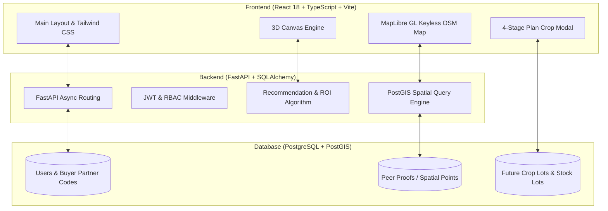

# 🌾 CropShift — Climate-Resilient Agricultural Shift & Forward-Contracting Marketplace


-brightgreen?style=for-the-badge&logo=openstreetmap)


> **Empowering smallholder farmers across Karnataka to transition from low-yield, water-intensive crops to high-value oilseeds and pulses while securing direct pre-harvest buyer forward contracts.**

---

## 📌 Problem Statement

In agricultural regions across Karnataka (e.g., Shivamogga, Hassan, Mysuru, Tumkur, Dharwad, Belagavi, Haveri), smallholder farmers face critical challenges:
1. **Water & Financial Distress**: Heavy reliance on water-heavy traditional crops (paddy, sugarcane) causes severe groundwater depletion and low net financial returns.
2. **Fear of Transition (Lack of Peer Proof)**: Farmers hesitate to adopt high-value oilseeds (*Groundnut, Sunflower, Soybean, Sesame, Mustard, Castor, etc.*) because they cannot see whether nearby neighboring farmers have successfully cultivated them.
3. **Price Volatility & Middlemen**: Selling produce post-harvest without pre-committed buyers exposes farmers to distressed market prices during harvest gluts.

---

## 💡 The CropShift Solution

**CropShift** combines agronomic AI decision science, keyless geospatial mapping, 3D field plot simulation, and direct buyer forward-contracting to create a complete agricultural shift ecosystem:

```
┌─────────────────────────┐      ┌─────────────────────────┐      ┌─────────────────────────┐
│   3D CROP SIMULATOR     │ ───► │ PEER FARMER NETWORK MAP │ ───► │   FARMER MARKETPLACE    │
│ Soil, Water & ROI Rules │      │ Keyless PostGIS Proofs  │      │ Direct Buyer Contracts  │
└─────────────────────────┘      └─────────────────────────┘      └─────────────────────────┘
```

---

## ✨ Key Features

### 1. 🧪 3D Interactive Crop Simulator
- **Agronomic Inputs**: Analyzes soil pH, NPK nutrients, irrigation type, land acreage, and target district.
- **Decision Engine**: Recommends top alternative oilseed/pulse crops, calculating suitability %, projected yield (Q/acre), net ROI gain (₹/acre), and government subsidy eligibility.
- **3D Field Simulation**: Renders interactive 3D plant structures and field plots using Three.js / React Three Fiber.

### 2. 🗺️ Keyless Geospatial Peer Farmer Network
- **Dynamic Peer Matching**: Automatically queries PostGIS for verified demo farmers growing the recommended crop within a **50 km / 100 km radius**.
- **100% Keyless Map Engine**: MapLibre GL powered by standard OpenStreetMap raster tiles (`tile.openstreetmap.org`) with zero third-party API key watermarks or dark mode errors.
- **Social Proof**: Displays cohort metrics, harvest timelines, soil compatibility, and peer contact requests.

### 3. 🛒 4-Stage Crop Entry & Farmer Marketplace
- **Pre-Harvest Listings**: Farmers list planned production lots before sowing using a guided 4-stage modal (*Crop & Land → Yield & Target Price → Schedule → Review*).
- **Data Isolation**: Strict architecture separating pre-harvest planned crops (`FutureCropLot`) from ready post-harvest inventory (`StockLot`).
- **Direct Commercial Offers**: Institutional buyers submit transparent purchase agreements directly to farmers.

### 4. 🏢 Institutional Buyer Sourcing Portal
- **Partner Code System**: Auto-assigns persistent corporate reference codes (`BUY-XXXX-KAR`) to authenticated buyer profiles.
- **Sourcing Search**: Filters planned crop yields by district, harvest availability date, and volume (quintals).

### 5. 📞 Offline Voice Advisory & Telephony Support
- **Internet-Free Access**: Enables offline farmers to dial Voice Support anytime without internet.
- **Helpline Number**: `09513886363`
- **Access PIN**: `PIN: 8618-8551-17`

---

## 🏗️ System Architecture & Tech Stack



---

## 🚀 Quick Start Guide

### Prerequisites
- **Node.js**: `v18.x` or `v20.x`
- **Python**: `v3.11+`
- **PostgreSQL**: `v15+` with **PostGIS** extension enabled

---

### 1. Backend Setup

```bash
# Navigate to backend directory
cd backend

# Create virtual environment
python -m venv .venv
source .venv/bin/activate  # On Windows: .venv\Scripts\activate

# Install dependencies
pip install -r requirements.txt

# Setup environment variables (.env)
cp .env.example .env

# Run database migrations and seed demo dataset
python -m app.database.init_db
python -m app.database.seed

# Start FastAPI dev server
uvicorn app.main:app --reload --port 8000
```
Backend API will be live at: `http://localhost:8000` (Swagger docs at `http://localhost:8000/docs`)

---

### 2. Frontend Setup

```bash
# Navigate to frontend directory
cd frontend

# Install Node packages
npm install

# Start Vite dev server
npm run dev
```
Frontend Web App will be live at: `http://localhost:5173`

---

## 🧪 Testing & Verification

Run tests across both frontend and backend test suites:

```bash
# Frontend Type Check
cd frontend
npx tsc --noEmit

# Frontend Unit & Component Tests (Vitest)
npm test -- --run

# Production Build Check
npm run build

# Backend Test Suite (Pytest)
cd ../backend
pytest
```

---

## 📁 Repository Structure

```
CropShift/
├── backend/
│   ├── app/
│   │   ├── api/v1/          # REST Endpoints (Auth, Recs, Peers, Bids, Lots)
│   │   ├── core/            # Security, JWT, Configuration
│   │   ├── database/        # Session, Models, Seed Data (70 Peer Proofs)
│   │   ├── models/          # SQLAlchemy Database Models (User, FutureCropLot, StockLot)
│   │   └── services/        # Recommendation Engine, PostGIS Query Service
│   └── tests/               # Pytest Test Suites
├── frontend/
│   ├── src/
│   │   ├── components/      # UI Cards, 3D Plot Canvas, Keyless Map, Modals
│   │   ├── pages/           # Recommendation, Marketplace, Buyer Portal, IVR
│   │   ├── services/        # Axios API Client & Storage Utilities
│   │   ├── tests/           # Vitest UI & Integration Tests
│   │   └── types/           # TypeScript API Contract Definitions
│   └── vite.config.ts       # Vite Config & Proxy Settings
└── README.md
```

---

## 🔑 Demo Credentials

| Role | Email | Password | Details |
| :--- | :--- | :--- | :--- |
| **Farmer** | `farmer@cropshift.in` | `farmer123` | Shivamogga district, Paddy shift to Groundnut |
| **Buyer** | `buyer@cropshift.in` | `buyer123` | Verified Partner Code: `BUY-0042-KAR` |

---

## 📄 License & Attribution

Distributed under the **MIT License**. See `LICENSE` for more information.

*Built with ❤️ for the agricultural community of Karnataka.*
